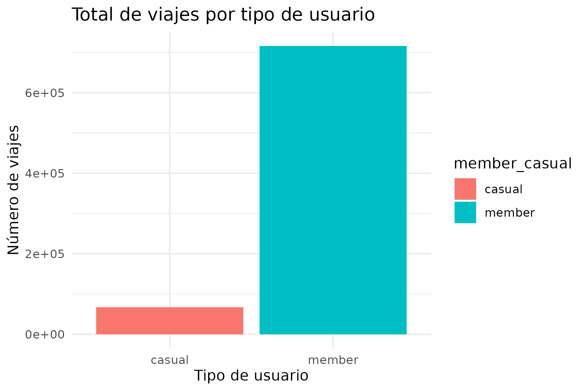
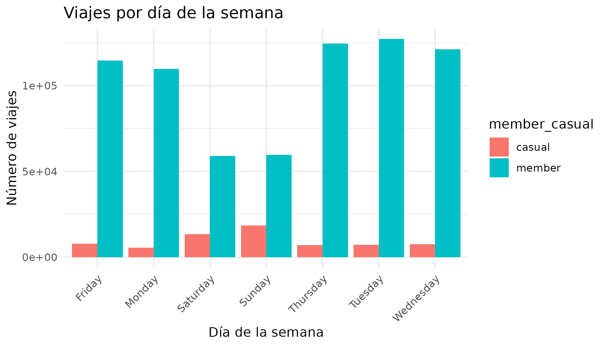
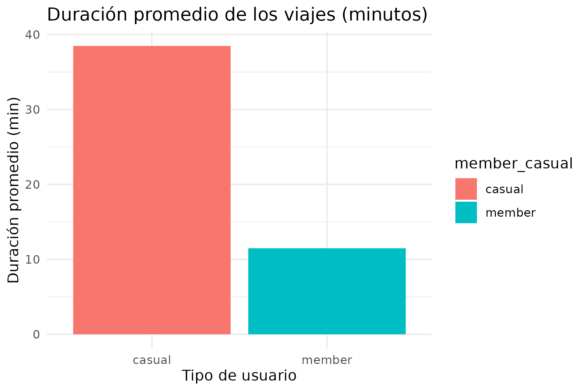
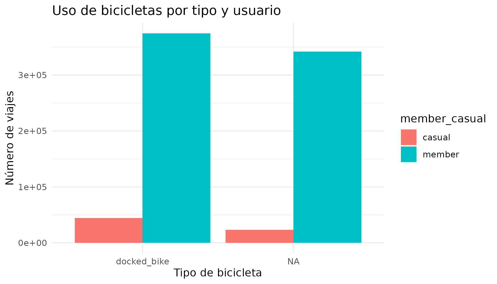
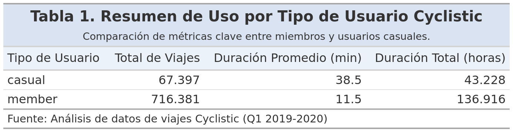

# 1) Resumen Ejecutivo

Cyclistic busca maximizar membresías anuales.

**Objetivo:** Identificar diferencias en el uso entre *casual riders* y *annual members* para diseñar estrategias de conversión.

**Preguntas clave:**
- ¿Cómo difieren en duración, frecuencia y días de uso?
- ¿Qué patrones estacionales existen?

---

# 2) Contexto y Pregunta de Negocio

## 2.1 Business Task

Analizar y comparar el uso del sistema Cyclistic por parte de *casual riders* y *annual members* usando los datasets Divvy 2019 Q1 y Divvy 2020 Q1 (limitación técnica de RStudio gratuito), para identificar diferencias de comportamiento que fundamenten una estrategia de conversión.

**Entregables:**
a) Enunciado del encargo
b) Fuentes de datos
c) Documentación de limpieza
d) Resumen de análisis
e) Visualizaciones y hallazgos clave
f) Tres recomendaciones priorizadas

## 2.2 Stakeholders

- **Lily Moreno (Marketing Director):** espera insights accionables y visualizaciones pulidas.
- **Marketing Analytics Team:** produce y reporta el análisis.
- **Cyclistic Executive Team:** decide si aprueba la estrategia basada en hallazgos.

---

# 3) Datos y Metodología

## 3.1 Fuentes y metadatos

|         Archivo         | Fuente | Período | Formato | Filas aprox. |
|-------------------------|--------|---------|---------|--------------|
| Divvy_Trips_2019_Q1.csv | Divvy (Chicago) | Ene–Mar 2019 | CSV | ~365,000 |
| Divvy_Trips_2020_Q1.csv | Divvy (Chicago) | Ene–Mar 2020 | CSV | ~400,000 |

**Fuente:** Motivate International Inc. *Divvy Bicycle Sharing Data*.
Disponible en: [https://divvy-tripdata.s3.amazonaws.com/index.html](https://divvy-tripdata.s3.amazonaws.com/index.html)
Licencia: Creative Commons Attribution 4.0.

---

# 4) PREPARE

Verificación de existencia de datasets crudos y carga inicial en RStudio Cloud.

```{r load-data, message=FALSE, warning=FALSE}
# Carga segura del dataset procesado
# La ruta ahora sube dos niveles (../../) para llegar a la raíz del proyecto,
# y de ahí, accede a 'Cyclistic_Capstone_Files/data_processed/clean_data.rds'
# y 'Cyclistic_Capstone_Files/scripts/02_data_cleaning.R'
if (!file.exists("../../Cyclistic_Capstone_Files/data_processed/clean_data.rds")) {
  source("../../Cyclistic_Capstone_Files/scripts/02_data_cleaning.R")
}

clean_data <- readRDS("../../Cyclistic_Capstone_Files/data_processed/clean_data.rds")

cat("Dimensiones del dataset:", dim(clean_data), "\n")
```

---

# 5) PROCESS

Comparación de estructuras entre 2019 y 2020.

- Columnas 2019 no presentes en 2020:
trip_id, start_time, end_time, bikeid, tripduration, from_station_id, from_station_name, to_station_id, to_station_name, usertype, gender, birthyear

- Columnas 2020 no presentes en 2019:
ride_id, rideable_type, started_at, ended_at, start_station_name, start_station_id, end_station_name, end_station_id, start_lat, start_lng, end_lat, end_lng, member_casual

**Decisiones:**
- Renombrar columnas de 2019 para coincidir con 2020
- Agregar columnas faltantes como NA
- Traducir codificación de `member_casual` (Subscriber → member, Customer → casual)
- Calcular `ride_length` y `day_of_week`
- Filtrar outliers (<1 min o >1440 min)

* Dimensiones finales: ~783k filas × 17 columnas.

---

# 6) ANALYZE

```{r analyze, message=FALSE, warning=FALSE}
library(dplyr)

summary_by_user <- clean_data %>%
  group_by(member_casual) %>%
  summarise(
    total_viajes = n(),
    duracion_promedio_min = round(mean(ride_length, na.rm=TRUE), 1),
    duracion_total_horas = round(sum(ride_length, na.rm=TRUE)/60, 0),
    .groups="drop"
  )
# La línea 'summary_by_user' se eliminó para evitar que se imprima
# la tabla sin formato aquí, ya que se mostrará formateada en la Sección 8.
```

---

# 7) VISUALIZE

```{r visualize, echo=FALSE, message=FALSE, warning=FALSE, out.width="80%", fig.align="center"}
# Ajusta las rutas de las imágenes también




```

---

# 8) SHARE — Summary Table

```{r summary-table, echo=FALSE}
library(gt) # Carga el paquete gt
library(dplyr) # Asegúrate de que dplyr esté cargado para el procesamiento de datos

# Regenera summary_by_user si el chunk 'analyze' no está antes
# o si prefieres que la tabla se genere completamente en este chunk
if (!exists("summary_by_user")) {
  # Asegúrate de que clean_data esté cargado en este punto o vuelve a cargarlo
  clean_data <- readRDS("../../Cyclistic_Capstone_Files/data_processed/clean_data.rds")

  summary_by_user <- clean_data %>%
    group_by(member_casual) %>%
    summarise(
      total_viajes = n(),
      duracion_promedio_min = round(mean(ride_length, na.rm=TRUE), 1),
      duracion_total_horas = round(sum(ride_length, na.rm=TRUE)/60, 0),
      .groups="drop"
    )
}

# La tabla gt se genera aquí
summary_by_user_gt <- summary_by_user %>%
  gt() %>% # Transforma el dataframe en un objeto gt
  cols_label(
    member_casual = "Tipo de Usuario",
    total_viajes = "Total de Viajes",
    duracion_promedio_min = "Duración Promedio (min)",
    duracion_total_horas = "Duración Total (horas)"
  ) %>%
  tab_header(
    title = md("**Tabla 1. Resumen de Uso por Tipo de Usuario Cyclistic**"), # Título principal
    subtitle = md("Comparación de métricas clave entre miembros y usuarios casuales.") # Subtítulo
  ) %>%
  fmt_number( # Formatea las columnas numéricas
    columns = c(total_viajes, duracion_total_horas),
    sep_mark = ".", # Separador de miles: punto
    decimals = 0 # Sin decimales para estos valores
  ) %>%
  fmt_number( # Formatea la duración promedio
    columns = duracion_promedio_min,
    sep_mark = ".", # Separador de miles (aunque no habrá en este caso)
    decimal_mark = ",", # Separador de decimales: coma
    decimals = 1 # Un decimal
  ) %>%
  tab_source_note(
    source_note = md("Fuente: Análisis de datos de viajes Cyclistic (Q1 2019-2020)") # Nota al pie
  ) %>%
  tab_options(
    table.width = pct(70), # Ancho de la tabla
    data_row.padding = px(3), # Espaciado de las filas
    heading.background.color = "#D9E3F1", # Color de fondo del encabezado
    column_labels.background.color = "#EBF2FA", # Color de fondo de las etiquetas de columna
    table_body.hlines.color = "#E0E0E0", # Color de las líneas horizontales
    table_body.border.bottom.color = "#B0B0B0" # Color del borde inferior
  )

# Guarda la tabla como imagen (es importante que la ruta sea correcta y la carpeta exista)
gtsave(summary_by_user_gt, "../../Cyclistic_Capstone_Files/outputs/summary_table.png")

# INCLUYE LA IMAGEN DE LA TABLA EN EL DOCUMENTO

```

---

# 9) Hallazgos clave

- **Members** representan >90% de viajes, cortos y constantes
- **Casuals** realizan menos viajes, más largos y en fines de semana
- Diferencia clara: **recreación vs. transporte**

---

# 10) Recomendaciones

1.  **Campañas recreativas fin de semana**
    - Beneficios en ocio, descuentos familiares
2.  **Conveniencia y ahorro urbano**
    - Mensajes de costo-beneficio (“5 viajes = membresía pagada”)
3.  **Optimizar experiencia digital y flota**
    - Promocionar bicicletas cómodas y acceso exclusivo para miembros

---

# 11) Limitaciones

- Datos restringidos a Q1-2019 y Q1-2020
- Diferencias en esquema entre años
- Variables demográficas incompletas

---

# 12) Conclusión

- Diferencias claras permiten estrategias de conversión
- Casuals → enfocar en recreación
- Members → reforzar eficiencia semanal y ahorro
- Potencial para aumentar membresías y estabilizar ingresos

---

# 13) Anexo — Trazabilidad mínima

- Datos: Divvy (Chicago) Q1-2019 y Q1-2020; licencia CC BY 4.0
- Pipeline: unificación de esquemas, limpieza de outliers, cálculo de ride_length y day_of_week
- Artefactos: `clean_data.rds` y gráficos en `Cyclistic_Capstone_Files/outputs/`