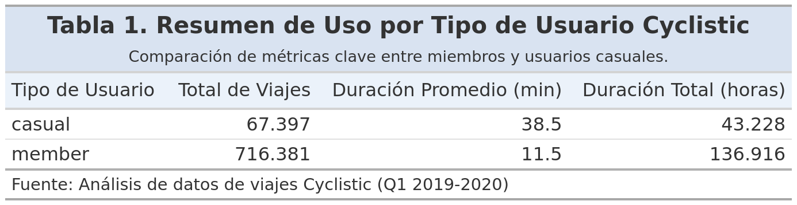
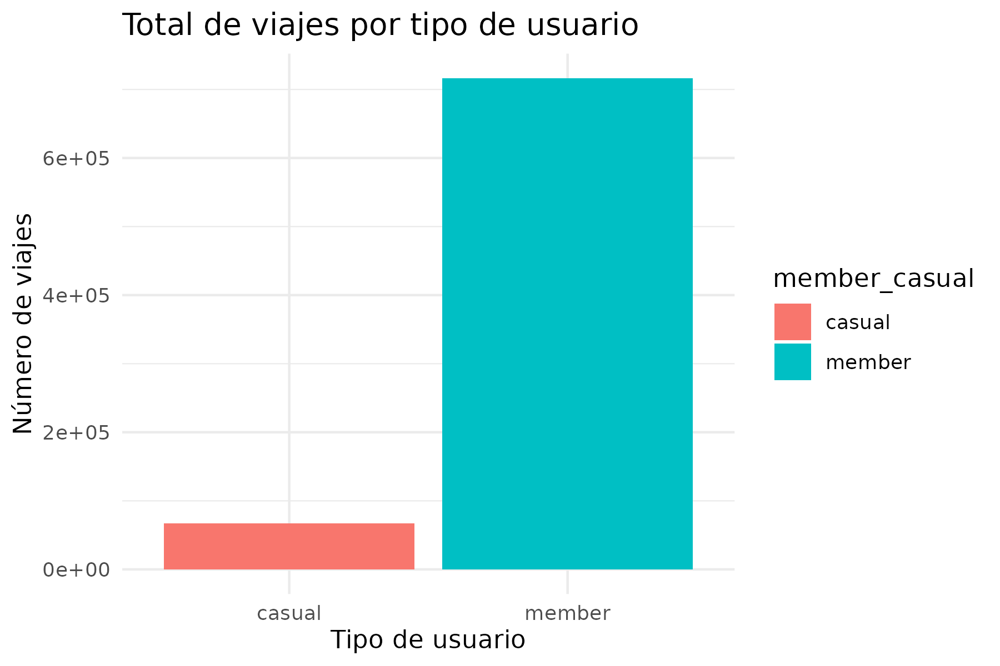
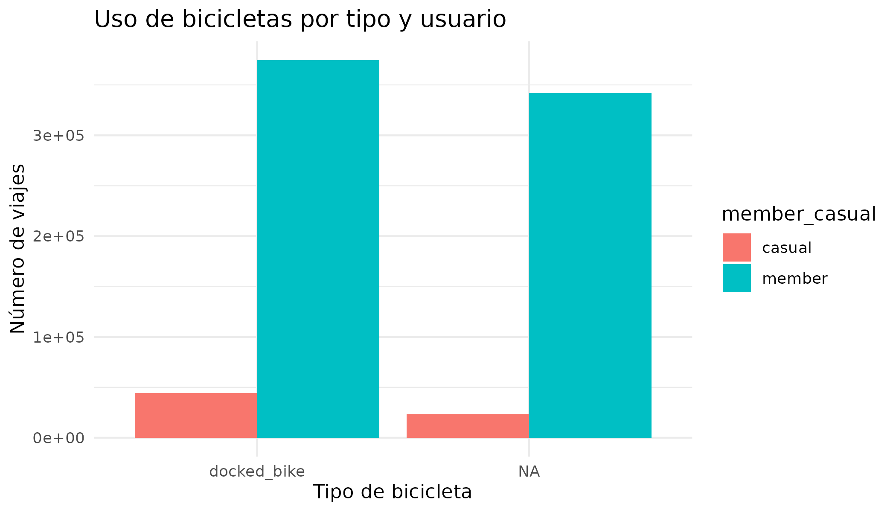
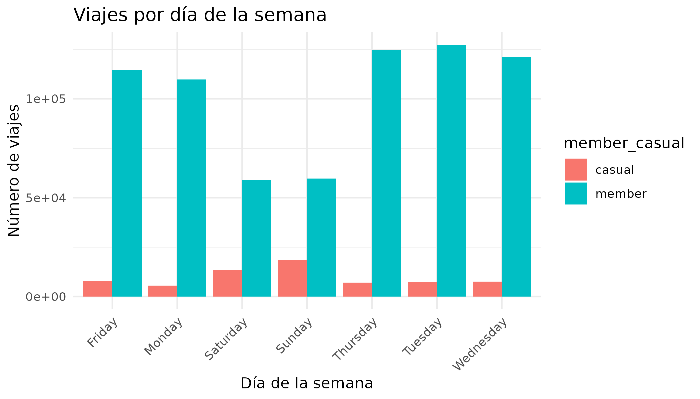
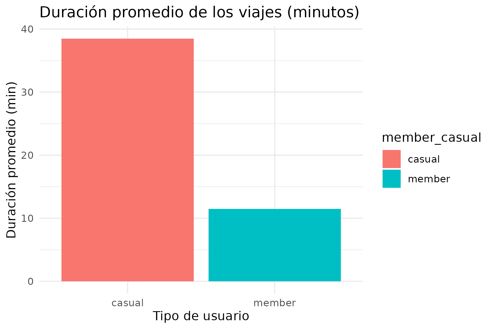

# Cyclistic Capstone — Google Data Analytics

**Contexto:** Caso final del certificado de Google Data Analytics. Empresa ficticia de bicicletas en Chicago busca aumentar conversión de usuarios casuales a miembros.  
**Acción:** Limpieza de datos, consultas SQL y análisis exploratorio en R.  
**Impacto:** Identificación de patrones de uso y recomendaciones de segmentación para marketing y fidelización.

---

## Preguntas de negocio → Métrica → Resultado
- ¿Cuándo usan más el servicio? → viajes por mes/día → FINES DE SEMANAS
- ¿Qué segmentos convierten mejor? → % miembro vs casual → MIEMBROS
- ¿Qué estaciones aportan más? → top estaciones → 

---

## Datos
- Fuente oficial: [[link al dataset público]](https://github.com/CarlosMorenoAD/capstone-google-data-analytics).  
- Periodo: 2019 - 2021.  
- Limitaciones: Datos abiertos, posibles inconsistencias.

---

## Reproducir
1. Instalar R y librerías: `tidyverse`, `lubridate`, `janitor`.  
2. Ejecutar `/notebooks/analysis.R`.  
3. Consultas SQL en `/notebooks/queries.sql`.  
4. Ver reporte en `/reports/` o demo en GitHub Pages (`/docs/`).

---

## Resultados

### Resumen de datos

### Total de viajes por tipo de usuario

### Uso de bicicletas por tipo

### Viajes por día de la semana

### Duración promedio por tipo de usuario

---

## Próximos pasos
- [ ] Modelo simple de propensión a membresía.  
- [ ] Test A/B de ofertas por franja horaria.  
- [ ] Enriquecer con clima/eventos.
